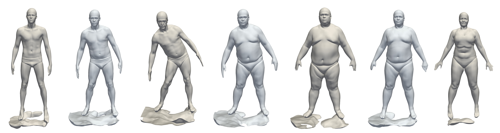

# IGR: Implicit Geometric Regualrization for Learning Shapes
<p align="center">
  
</p>

This repository contains an implementation to the ICML 2020 paper: "Implicit Geometric Regualrization for Learning Shapes".

IGR is a deep learning approach for learning implicit shape representations directly from  raw point clouds with or without normal data.

For more details visit: https://arxiv.org/abs/2002.10099.

## Installation Requirmenets
The code is compatible with python 3.7 and pytorch 1.2. In addition, the following packages are required:  
numpy, pyhocon, plotly, scikit-image, trimesh.

## Usage
### Learning shapespace from the D-Faust oriented point clouds

#### Data
The raw scans can be downloaded from http://dfaust.is.tue.mpg.de/downloads.
In order to sample point clouds with normals use:

```
cd ./code
python preprocess/dfaust.py --src-path SRC_PATH --out-path OUT_PATH
```
where SRC_PATH is the absoule path of the directory with the original D-Faust scans, and OUT_PATH is the absolute path
of the directory on which you wish to output the processed point clouds.

It is also possible to process only train
data with input --mode 0 our only test with --mode 1.
 
In case you wish to only process part of the data (e.g. for parallel processing) it is possible by adding --names NAME_1,NAME_2,...,NAME_k where NAME_i 
is one of D-Faust shapes e.g. 50002, 50020.

After preprocessing ended adjust the file ./shapespace/dfaust_setup.conf to the cur path of the data:
```
train
{
  ...
  dataset_path = OUT_PATH/dfaust_processed
  ...
}
```

#### Predicting meshed surfaces with IGR pretrained network
We have uploaded IGR trained network. To produce predictions on unseen test scans, run:
```
cd ./code
python shapespace/evaluate.py --checkpoint 1200 --exp_name dfaust_pretrained --split dfaust/test_all.json --exps_dir trained_models
```
In case you wish to generate less models you can use --split dfaust/test_models.json

#### Interpolating latents of IGR pretrained network
To meshs of latent interpolation between two shapes use:
```
cd ./code
python shapespace/interpolate.py --interval INTERVAL --checkpoint 1200 --exp_name dfaust_pretrained --exps_dir trained_models
```
Where INTERVAL is the number (int) linspace of latent interpolations.

In case you wish to interpolate different shapes adjust the file dfaust/interpolation.json
 
#### Training
If you want to train IGR yourself, run:
```
cd ./code
python shapespace/train.py
```

### Surface reconstruction
IGR can also be used to reconstruct a single surface given a point cloud with or without normal data. Adjust reconstruction/setup.json to the
path of the input 3D point cloud
```
train
{
  ...
  dataset_path = your_path
  ...
}
```
And in case your data has no normals adjust:
```
network
{
    loss
    {
        normals_lambda=0
    }
  ...
  dataset_path = your_path
  ...
}
```
otherwise keep normals_lambda=1.

Then, run training:
```
cd ./code
python reconstruction/run.py 
```
Finally, to produce the meshed surface, run:
```
cd ./code
python reconstruction/run.py --eval --checkpoint CHECKPOINT
```
where CHECKPOINT is the checkpoint you wish to evaluate of 'latest' if you wish to take the most recent epoch.
## Citation
If you find our work useful in your research, please consider citing:

    @incollection{icml2020_2086,
     author = {Gropp, Amos and Yariv, Lior and Haim, Niv and Atzmon, Matan and Lipman, Yaron},
     booktitle = {Proceedings of Machine Learning and Systems 2020},
     pages = {3569--3579},
     title = {Implicit Geometric Regularization for Learning Shapes},
     year = {2020}
    }
    	
## Related papers
* [Yariv et al. - Multiview Neural Surface Reconstruction with Implicit Lighting and Material](https://arxiv.org/abs/2003.09852)
* [Atzmon & Lipman. - SAL++: Sign Agnostic Learning with Derivatives (2020)](https://arxiv.org/abs/2006.05400)
* [Atzmon & Lipman. - SAL: Sign Agnostic Learning of Shapes From Raw Data (2020)](https://arxiv.org/abs/1911.10414)
* [Atzmon et al. - Controlling Neural Level Sets (2019)](https://arxiv.org/abs/1905.11911)
	
